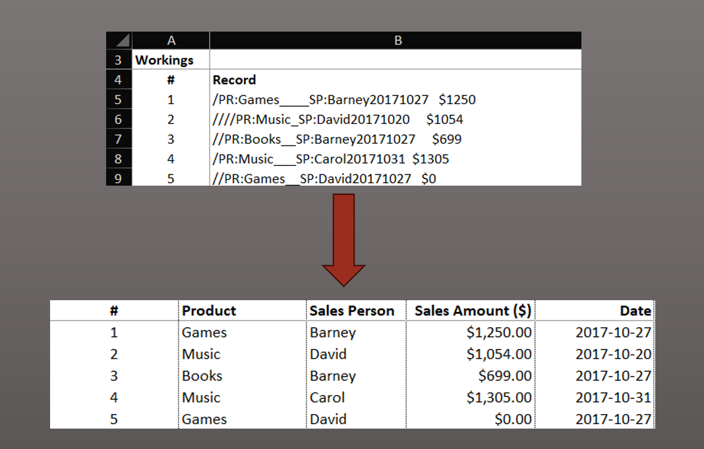

## Transforming Monthly Sales Raw Data

The original spreadsheet file included records of monthly sales, but in an unusable format for processing. Here, I discuss the process I followed to complete data cleaning and its transformation using Microsoft Excel functions to generate useful data, ready to be used for future data analysis.

The raw data contained 496 records of each sale, including the sold product category (defined by PR), the sales person name (defined by SP), operation date, including year, month, and day; and total amount sold.

Each of the records was contained in its individual row. The input also contained special non alpha-numeric characters, non-printing characters, including whitespaces, and nonbreaking spaces.

**Note:** _In this page, I explain the thought process I followed, along with the functions used for this. The cells of code contain the formula for row 5 (first row of records on the file). The same formulas were applied on the rows beneath it._



First, in order to identify invisible characters at the end of the string, the **CODE** and **RIGHT** functions were used, and then **CLEAN** to remove all non-printing characters. After this, the **CODE** function shows there is a character with an **ASCII code** of _32_, which means there is an extra white space at the end of the string. This was removed later.


```
=CODE(RIGHT(B5,1)) # COLUMN C FORMULA 

=CLEAN(B5)         # COLUMN D FORMULA

=CODE(RIGHT(B5,1)) # COLUMN E FORMULA
```

Following the cleaning of the end of the string, the special characters (slashes, underscores and extra white spaces and nonbreaking spaces) were eliminated using the **SUBSTITUTE**, **TRIM**, and **UNICHAR** functions.


```
=SUBSTITUTE(D5,UNICHAR(160),"") # COLUMN F FORMULA - replacing no-break spaces with empty strings ("")

=SUBSTITUTE(SUBSTITUTE(F5,"/",""),"_","")   # COLUMN H FORMULA - eliminating slashes and underscores

=TRIM(H5) # COLUMN I FORMULA - eliminating extra white spaces
```

The **SUBSTITUTE** function was used again to eliminate "PR" and "SP" from the string, leaving the  data ready to be extracted into individual columns.

For the data extraction, I considered it was convenient to locate the position of each space (" ") delimiting every part of the string.
The record contains three spaces, each one of them separating the product category, the employee's first name, the date and the total amount.
The **FIND** function was used as a way to locate each space substring within the cell.


```
=FIND(N5," ",1) # COLUMN O FORMULA - position of the first space

=FIND(N5," ",O5+1)   # COLUMN P FORMULA - position of the second space (taking the first space as a starting point for searching)

=FIND("$",N5,1)-1 # COLUMN Q FORMULA - position of the third space (taking the $ sign as a reference)
```

Taking these spaces' positions, each part of the data in the cell was extracted into its corresponding column with the functions **LEFT**, **MID**, and **RIGHT**.


```
=LEFT(N5,O5-1) # COLUMN R FORMULA - extracting characters before the first space

=MID(N5,O5+1,P5-(O5+1))   # COLUMN S FORMULA - extracting characters between the first and second spaces

=MID(N5,P5+1,Q5-(P5+1)) # COLUMN T FORMULA - extracting characters between the second and third spaces

=VALUE(RIGHT(N5,LENGTH(N5)-Q5-1)) # COLUMN U - extracting the last characters and formating the string into a number
```

Finally the extracted date was converted into a date format for an easier future analysis with the **DATE** function.


```
=DATE(LEFT(T5,4),MID(T5,5,2),RIGHT(T5,2)) # COLUMN V - converting the date as string into a date format
```
