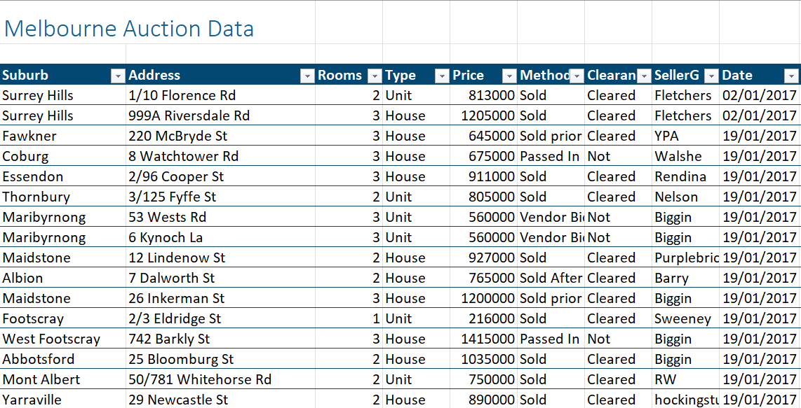
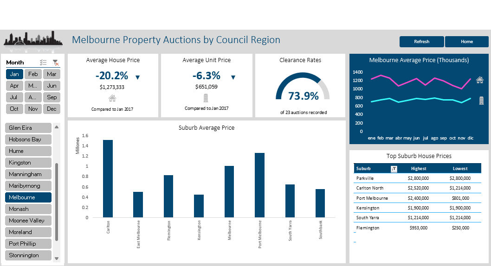
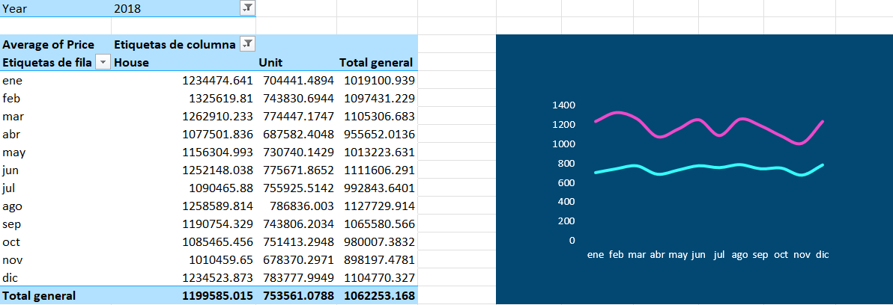
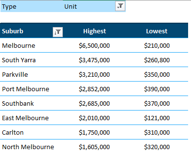

## Trends in the Melbourne Property Market

The main objective was to deliver a report containing the full data about auction of 25, 478 properties in some suburbs from the Metropolitan Councils in Victoria, Australia ([see a map here](https://www.viccouncils.asn.au/__data/assets/pdf_file/0009/32859/metropolitan-municipalities-map.pdf)), and to showcase the trends and key metrics in the property market during 2017 and 2018.

The original file had the records for the property auctions during 2017 and 2018 in Melbourne, Australia. The raw data was contained in a spreadsheet, describing the location, address, property type, and sale information.

For a better analysis, the data cleaning and transformation involved the formatting of values into the right data type, like numbers and dates. The _Date sold_ field was split into different columns : _Year_ and _Month_. The resulting fields included:

|  |  |  |  |  |
|---|---|---|---|---|
| Suburb  | Address  | Number of rooms  | Property type  | Price  |
| Sales method   | Clearance  | Seller  | Date sold  | Distance  |
| Postcode   | Bathrooms  | Car space  | Landsize  | Building area  |
| Year built   | Council area  | Latitute  | Longitude  | RegionName  |
| Property count   | Year  | Month  |   |   |

Notes: _Sales method_ referred to the way the property was adquired by the client, either it being sold, sold prior or after an auction, passed in, no bid, withdrawn, or with a vendor bid. _Distance_ referred to the average distance from the Melbourne Central Business District (downtown) and _Property type_ referred to either a house or a unit (apartments)

Once the data was clean and ready, it was organized into a table for an easier field grouping and an easier use of filters.
The final report consisted of a summary of data organized in a dashboard and pivot tables.

### Dashboard - Auctions by Council Region Stats

The dashboard shows a summary for each council, as well as the trends for the average price during the year or each month. It also displays the clearance rates for the available properties and the change of the average house or unit price during 2018 in comparison to the 2017 average during the same selected month. Additionally, it displays the top suburb highest and lowest house prices in the selected Council Region. The dashboard was completed by adding tables and charts generated from pivot tables.

#### Pivot Tables - Melbourne Trends

Since Melbourne is the most important economic center in the state of Victoria and its capital, it was of interest to look closely into the market trends in the region. For this, data from Melbourne was summarized in a pivot table showing the average prices for houses and units per month during 2017 and 2018.

#### Pivot Tables - Top Suburbs

The pivot table show the top suburbs in a Council Region for a certain year, also displaying the most and least expensive property prices in each of them.

### Findings

* The data showed an increase in the average price for both property types in all councils, except for Hume, Kingston, Moonee Valley and Moreland (4 out of 25).

* The Council Region with the highest average house price was Boroondara, with a value of $2, 296, 180 by the end of 2018.

* Meanwhile, the highest average unit price by the end of 2018 was found in the Bayside Council Region, with a value of $ 1, 111, 633.

* In contrast, by the end of 2018, Wyndham had the lowest average house price, with an average value of $580 850, while Whittlesea had the lowest average price for a unit at $437, 000.

* The property market in Melbourne showed a steady growth during every month in 2017. However, during 2018 it showed a fluctuation in the average house prices, with a drop in prices during March, April and most of the second half of the year, but reaching an average value by the end of the year similar to the value at the start of 2018, showing a recovery. Meanwhile, the average unit prices remained stable.

* The top suburbs for auctions in Melbourne were South Yarra, Parkville and Carlton, with their most expensive houses being sold at more than $5M. The same suburbs were also in the top for units sales, but the most expensive unit was located in Melbourne CBD, with a price over $6M.

* At the same time, the suburb in Melbourne with the lowest average cost for a property was Docklands, followed by Southbank and the Melbourne CBD, which let us see there is a wide range of prices in the porperty market.

