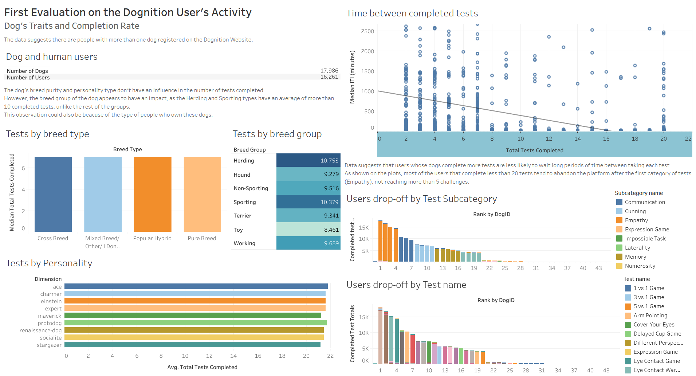
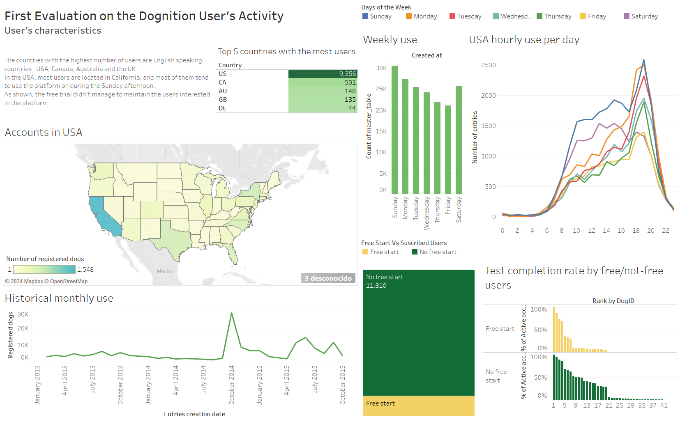

# Quick Insights for the Dognition Development Team

Dognition offers a way for dogs to be better understood by their owners. This is achieved thanks to a series of tests to evaluate a variety of skills and behavioural traits, in which the results are then used to classify their personality into different categories.

A database provided by Dognition was examined with the use of **MySQL** to generate insights to find out how could the company retain their users and increase the number of customers using the platform. The general content of the database can be read thoroughly [here](assets/p04-dataextraction/00_Dognition-Data-Set-Description.pdf). Then, the extracted data was imported into **Tableau** to create data visualization to communicate the findings.

The analysis was split into two parts:

First, data extraction was focused on understanding which dogs' characteristics influenced how many tests were completed ([read the report](https://lugmenn.github.io/portfolio/2024_02_02-dog_db_extraction1.html)).

Second, data extraction was focused on understand the users that used the platform: when do they use it the most, where are they located, how much do they use it and whether or not the free plan helped retaining them as users ([read the full **SQL** script](https://github.com/lugmenn/Insights-for-Dognition/blob/main/03_UserCircumstances_v_CompletedTests.sql)).

## Findings in the Dogs' Data

* The dog personalities’ groups didn´t show a difference in the completed tests totals.

* The same observation is applicable when evaluating the dog’s breed purity.
    
* It´s not possible to assume with certainty whether the dog’s breed group has a direct influence or not.

* However, it was found the Herding and Sporting groups had the highest number of completed tests.

* Dognition could decide to explore more deeply these groups and **develop marketing strategies for owners of these dog breed types, as well as create special content** for them.

* The neutered dogs showed to have 1 to 2 more completed tests than those who weren’t. The analysis should be extended to find if the difference persists when other variables are paired.

## Findings in the Users' Data

* Most of the users are active during the weekend, specially on Sundays.

* Most of the users are located in English speaking countries : USA, Canada, Australia, and the UK. A **website translation to other languages** could attract new potential customers from other countries. Half of the total Dognition users live in the USA.

* Most of the American users are located in California. The **marketing team could develop strategies with California as a target** or other states with a similar population type.

* The American users use the platform mostly during the afternoon, specially on Sundays. These might be a good time to **send reminders or notifications for completing tests, as well as having a news feed/sending out tips on dog care**.

* The free trial didn't helped retaining customers. A possible solution would be to **mix the tests subcategories in the first testing stages to show more variety on the platform dinamics**.

