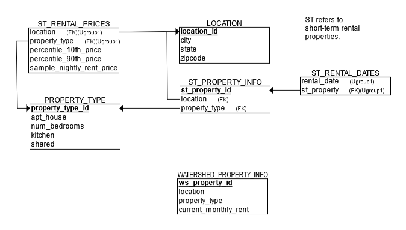

## DATA EXTRACTION FROM DATABASE FOR ANALYSIS 

For this project, I used MySQL to extract data from a database that included some properties' records from Watershed Properties used as long\-term rentals, regarding their location and building characteristics, as well as yearly profits and occupancy rate. Another table included records from some other properties used as short term rentals, including their characteristics and rates per night.

Through SQL queries, the data was transformed in order to be merged into a single table and select the short\-term rentals with similar characteristics as the ones on the list of long\-term rentals from Watershed, having both the yearly profits and the estimate rates per night needed to complete the analysis and the profits' estimates needed to decide which properties would increase total profits if they were to be converted into shot term rentals. This analysis was completed on Excel \(you can [read more here](https://www.datascienceportfol.io/lugmenn/projects/0)\).



These are some of the queries ran on MySQL to complete the data extraction and part of its transformation.

EXPLORING THE AVAILABLE DATA

Reviewed each of the tables' fields contained in them.

```sql
SHOW columns FROM capstone.location;

SHOW columns FROM capstone.property_type;

SHOW columns FROM capstone.st_property_info;

SHOW columns FROM capstone.st_rental_dates;

SHOW columns FROM capstone.st_rental_prices;

SHOW columns FROM capstone.watershed_property_info;
```


I explored the structure of the data contained in each of the tables in order to know if data needed to be cleaned and transformed. Additionally, I reviewd if there were any NULL Values in


```sql
SELECT * 
FROM capstone.location
LIMIT 50;

#-- REVIEW IF THERE AREN'T ANY NULL VALUES IN 'state', AND SUMMARIZE HOW MANY RECORDS EACH ONE OF THEM HAS
SELECT DISTINCT 
		state,
		COUNT(location_id) as Number_of_records
FROM capstone.location
GROUP BY state;

SELECT * 
FROM capstone.property_type;

SELECT * 
FROM capstone.st_property_info
LIMIT 50;

SELECT * 
FROM capstone.st_rental_dates
LIMIT 50;

SELECT * 
FROM capstone.st_rental_prices
LIMIT 50;

SELECT * 
FROM capstone.watershed_property_info;

```

#-- FIRST, THE AVAILABLE SHORT-TERM RENTAL PROPERTIES (st_property) DATA WILL BE UNIFIED
#-- FIND OUT EXACTLY WHAT rental_date REALLY MEANS

SELECT
	rental_date,
    st_property	
FROM capstone.st_rental_dates
WHERE st_property LIKE '%ST100%';

#-- NOTICE SOME RECORDS CONTAIN CONSECUTIVE DAYS, WHILE SOME DON´T
#-- THIS MEANS 'rental_date' REFERS TO THE SPECIFIC DAY(S) A PROPERTY WAS RENTED FOR A SHORT-TERM STAY, WHETHER IT WAS JUST ONE NIGHT OR MULTIPLE NIGHTS STAY

#-- FIND OUT HOW MANY TIMES EACH SHORT-TERM PROPERTY WAS OCCUPIED

SELECT DISTINCT 
    st_property,
    COUNT(rental_date)
FROM capstone.st_rental_dates
GROUP BY st_property;

#-- FILTER THE PREVIOUS RESULTS TO OBTAIN THE NUMBER OF DAYS EACH SHORT-TERM RENTAL PROPERTY WAS OCCUPIED ONLY DURING 2015

SELECT DISTINCT
    st_property,
    COUNT(rental_date) AS number_rentedDays_2015
FROM capstone.st_rental_dates
WHERE YEAR(rental_date)=2015
GROUP BY st_property;

#-- CALCULATE THE OCCUPANCY RATE DURING 2015 FOR SHORT-TERM RENTAL PROPERTIES

SELECT DISTINCT
    st_property,
    COUNT(rental_date) AS number_rentedDays_2015,
    ROUND((COUNT(rental_date)/365*100),2) AS Occupancy_rate_2015
FROM capstone.st_rental_dates
WHERE YEAR(rental_date)=2015
GROUP BY st_property
ORDER BY Occupancy_rate_2015 DESC;

#-- USE THE PREVIOUS QUERY AND JOIN WITH THE OTHER TABLES TO ADD INFORMATION ABOUT THOSE PROPERTIES
#-- FIRST, ADD THE LOCATION INFO

SELECT DISTINCT
    p.st_property_id,
    p.location,
    p.property_type,
    occupancy_rate.number_rentedDays_2015,
    occupancy_rate.Occupancy_rate_2015
FROM capstone.st_property_info p 
INNER JOIN (
        SELECT DISTINCT
            rd.st_property,
            COUNT(rd.rental_date) AS Number_rentedDays_2015,
            ROUND((COUNT(rd.rental_date)/365*100),2) AS Occupancy_rate_2015
        FROM capstone.st_rental_dates AS rd
        WHERE YEAR(rd.rental_date)=2015
        GROUP BY rd.st_property
        ) AS occupancy_rate 
ON (p.st_property_id=occupancy_rate.st_property);

-- ADD DETAILED LOCATION INFO TO THE LAST TABLE

SELECT DISTINCT
    p.st_property_id,
    p.location,
    p.property_type,
    l.city,
    l.state,
    l.zipcode,
    occupancy_rate.number_rentedDays_2015,
    occupancy_rate.Occupancy_rate_2015
FROM 
    capstone.st_property_info p JOIN location l
    JOIN (
        SELECT DISTINCT
            rd.st_property,
            COUNT(rd.rental_date) AS Number_rentedDays_2015,
            ROUND((COUNT(rd.rental_date)/365*100),2) AS Occupancy_rate_2015
        FROM capstone.st_rental_dates rd
        WHERE YEAR(rd.rental_date)=2015
        GROUP BY rd.st_property
    ) AS occupancy_rate
    ON l.location_id=p.location AND p.st_property_id=occupancy_rate.st_property;

#-- ADD THE DETAILED PROPERTIES AND NIGHTLY RENTAL PRICE INFO TO THE LAST TABLE

SELECT DISTINCT
    p.st_property_id,
    p.location,
    p.property_type,
    l.city,
    l.state,
    l.zipcode,
    pt.apt_house,
    pt.num_bedrooms,
    pt.kitchen,
    pt.shared,
    rp.sample_nightly_rent_price,
    occupancy_rate.number_rentedDays_2015,
    occupancy_rate.Occupancy_rate_2015
FROM 
    capstone.st_property_info p JOIN location l 
    JOIN property_type pt
    JOIN st_rental_prices rp
    JOIN (
        SELECT DISTINCT
            rd.st_property,
            COUNT(rd.rental_date) AS Number_rentedDays_2015,
            ROUND((COUNT(rd.rental_date)/365*100),2) AS Occupancy_rate_2015
        FROM capstone.st_rental_dates rd
        WHERE YEAR(rd.rental_date)=2015
        GROUP BY rd.st_property
    ) AS occupancy_rate
    ON l.location_id=p.location 
        AND p.st_property_id=occupancy_rate.st_property
        AND rp.location=p.location AND rp.property_type=p.property_type
        AND p.property_type=pt.property_type_id;


#-- COMBINE THE UNIFIED SHORT-TERM PROPERTIES DATA WITH THE WATERSHED PROPERTIES (USING AN INNER JOIN)

SELECT DISTINCT
    w.ws_property_id,
    w.location,
    w.property_type,
    w.current_monthly_rent,
    st_properties_2015.city,
    st_properties_2015.state,
    st_properties_2015.zipcode,
    st_properties_2015.apt_house,
    st_properties_2015.num_bedrooms,
    st_properties_2015.kitchen,
    st_properties_2015.shared,
    st_properties_2015.sample_nightly_rent_price AS nightly_rent_price,
    st_properties_2015.number_rentedDays_2015,
    st_properties_2015.Occupancy_rate_2015
FROM watershed_property_info w JOIN (
            SELECT DISTINCT
                p.st_property_id,
                p.location,
                p.property_type,
                l.city,
                l.state,
                l.zipcode,
                pt.apt_house,
                pt.num_bedrooms,
                pt.kitchen,
                pt.shared,
                rp.sample_nightly_rent_price,
                occupancy_rate.number_rentedDays_2015,
                occupancy_rate.Occupancy_rate_2015
            FROM 
                capstone.st_property_info p JOIN location l 
                JOIN property_type pt
                JOIN st_rental_prices rp
                JOIN (
                    SELECT DISTINCT
                        rd.st_property,
                        COUNT(rd.rental_date) AS Number_rentedDays_2015,
                        ROUND((COUNT(rd.rental_date)/365*100),2) AS Occupancy_rate_2015
                    FROM capstone.st_rental_dates rd
                    WHERE YEAR(rd.rental_date)=2015
                    GROUP BY rd.st_property
                ) AS occupancy_rate
                ON l.location_id=p.location 
                    AND p.st_property_id=occupancy_rate.st_property
                    AND rp.location=p.location AND rp.property_type=p.property_type
                    AND p.property_type=pt.property_type_id
    ) AS st_properties_2015
        ON w.location=st_properties_2015.location 
        AND w.property_type=st_properties_2015.property_type;

#-- EXPORT THE GENERATED TABLE FOR ANALYSIS IN EXCEL, R AND/OR A QUICK REVIEW IN TABLEAU
```
