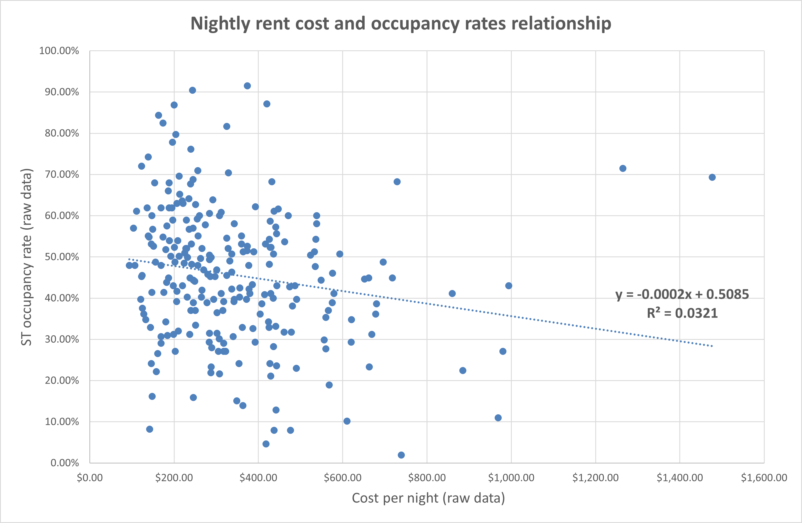
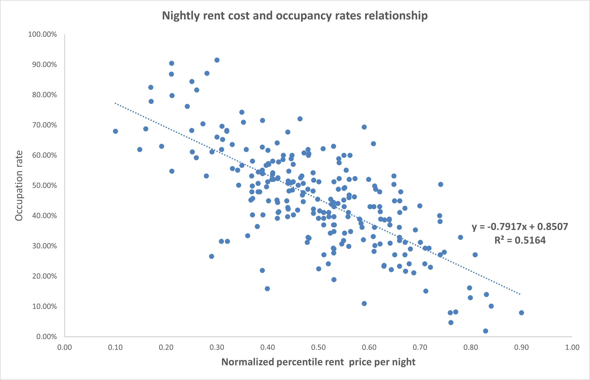
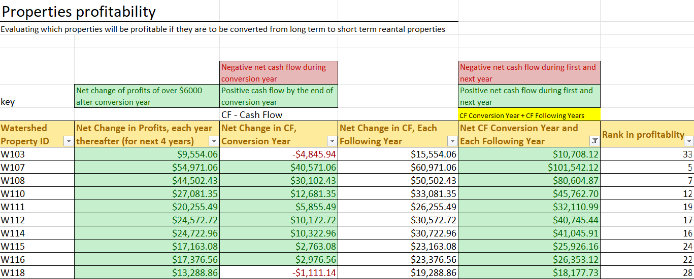
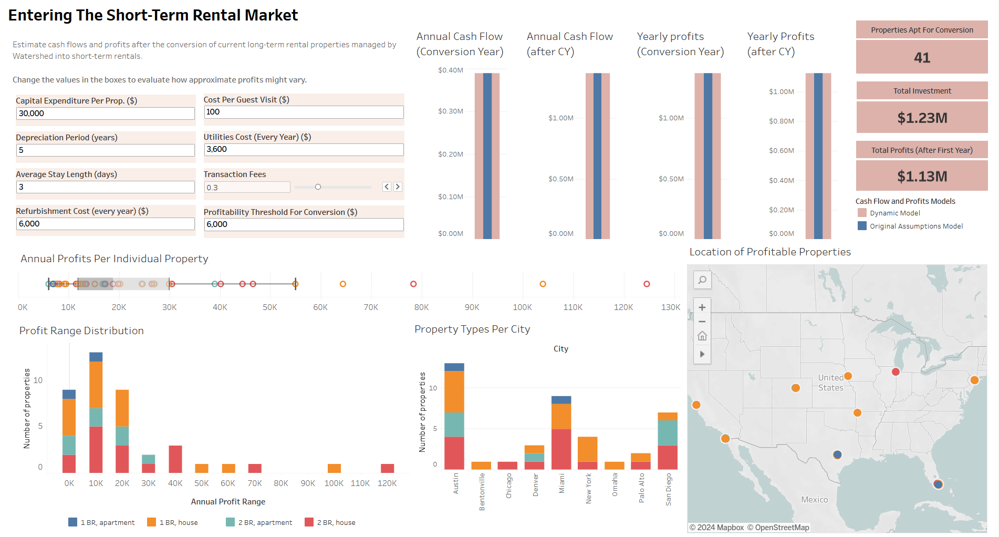

# Change in profits in the real estate industry

## Business problem and financial restrictions

Watershed Properties deals with the management of its clients' real estate properties. One of them was interested in knowing how much could the profits increase if he entered the short-term rental market (on platforms like Airbnb). At the time of the petition, he owned 234 properties set for long-term rents. The client was open to convert those properties, from long-term to short-term rentals, in which the annual profit had an increase of at least $6,000.

Due to this, each long-term property had to be compared to a similar one used for short-term rents, considering its property type, location and cost.

The final calculations of the net profits had to consider certain expenses and the ROI:

* Capital expenditure: $30,000, with a depreciation period of 5 years

* Utilities cost (per year): $3,600

* Maintenance and utilities replacement (each year after first year): $6,000

* Cleaning costs after each guest visit: $100

* Transaction fees (taxes and platform comissions): 30%

* Average length of guest stay is 3 nights

The data extraction and part of its transformation was completed using [**SQL queries**](https://lugmenn.github.io/portfolio/2024_03_watershed_database). Then, it was loaded into Excel, where its transformation was completed for the analysis.

## Data processing and analysis

Before making any analysis and evaluation, each annual cost had to be adjusted to a cost per night.

For this, I tried to find out if the expected annual occupancy for short-term properties ratio is directly related to the nightly cost, so a linear regression model was generated.

As visible, the variables do not have a strong relationship because another factor is involved in the available costs: the properties' location. This created the need to normalize the costs based on its 90th and 10th percentile distribution (which varied across cities).

After, this, the linear regression worked better as a prediction model to calculate the rough estimates for annual profits, optimizing the rent cost by the expected occupancy ratios.

The annual cost of rent was optimized into cost of rent per night using these percentiles, which then, considering the financial restrictions, were used to calculate net change in profits and net change in cash flows during the conversion year (with the initial investment), and then for the following years.

## Sharing the findings through Tableau

[Click here to read the dashboard in Tableau Public](https://public.tableau.com/views/WatershedProject_17105411802030/Dashboard1?:language=es-ES&:sid=&:redirect=auth&:display_count=n&:origin=viz_share_link).

In total, 41 properties out of 234 (5.7%) were apt for conversion, with an initial total investment of $1.23 M to generate a profit of $1.13 M each following year.

Most of the properties are between the $6, 000 to $20, 000 range in annual profits, most of them located in Texas and California, while the most profitable with more than $60, 000 of annual profits are located in Florida.

The dashboard includes adjustable parameters for all the financial restrictions set initially, which allows a comparison if the conditions are changed.
