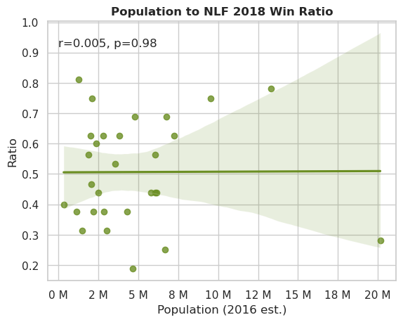

## Finding the correlation between different North-American metropolitan areas’ population and their Big Four teams’ Win/Lose ratio


The Big Four refers to the major professional sports leagues across North America (USA and Canada). These leagues include NFL, NBA, MBL and NHL, which contain 30 to 32 teams each, and are mostly based on the top populated metropolitan areas in both countries.

This analysis consisted of finding through the **Pearson correlation** how closely related are the Metropolitan Area population size and the Win/Lose ratio of the teams from each league, meaning the proportion of the won games against the total number of won AND lost games. Is it reasonable to expect a team to be more likely to win if the city it is based on is big, is the opposite to be expected or is there no relationship at all?

In this page, the full code for the NFL correlation analysis is included. To check the code for the NBA, MBL AND NHL, click here.

### Importing the libraries

Data was processed and analyzed with **Numpy**, **Pandas**, **Re** and **SciPy**. Then, **Matplotlib** and **Seaborn** were used for visualization.


```python
import pandas as pd
import numpy as np
import scipy.stats as stats
import re
from matplotlib import pyplot as plt
import matplotlib.ticker as ticker
import seaborn as sns
```

### Importing the data and setting up the dataframes

Source of data includes a cached table from Wikipedia with the 2016 population estimates in the Metropolitan Areas and a list of each Metro Area's teams from each league, as well as stats for all team from each league ranging from 2014 to 2018. The analysis was run on the results from the 2018 games.


```python
# dataframe with data for each city
cities=pd.read_html("assets/wikipedia_data.html")[1]

# filtering out unnecessary columns and rows
cities = cities.iloc[:-1,[0,3,5,6,7,8]]
cities.rename(columns = {'Population (2016 est.)[8]' : 'Population (2016 est.)'}, inplace=True)

# deleting special characters
cities[['NFL','NBA','NHL','MLB']] = (cities[['NFL','NBA','NHL','MLB']]
                                     .replace(to_replace="\[.*\]$", value="",regex=True)
                                     .replace(to_replace="—", value="",regex=True)
                                    )
cities.head()
```


<div>
<style scoped>
    .dataframe tbody tr th:only-of-type {
        vertical-align: middle;
    }

    .dataframe tbody tr th {
        vertical-align: top;
    }

    .dataframe thead th {
        text-align: right;
    }
</style>
<table border="1" class="dataframe">
  <thead>
    <tr style="text-align: right;">
      <th></th>
      <th>Metropolitan area</th>
      <th>Population (2016 est.)</th>
      <th>NFL</th>
      <th>MLB</th>
      <th>NBA</th>
      <th>NHL</th>
    </tr>
  </thead>
  <tbody>
    <tr>
      <th>0</th>
      <td>New York City</td>
      <td>20153634</td>
      <td>Giants Jets</td>
      <td>Yankees Mets</td>
      <td>Knicks Nets</td>
      <td>Rangers Islanders Devils</td>
    </tr>
    <tr>
      <th>1</th>
      <td>Los Angeles</td>
      <td>13310447</td>
      <td>Rams Chargers</td>
      <td>Dodgers Angels</td>
      <td>Lakers Clippers</td>
      <td>Kings Ducks</td>
    </tr>
    <tr>
      <th>2</th>
      <td>San Francisco Bay Area</td>
      <td>6657982</td>
      <td>49ers Raiders</td>
      <td>Giants Athletics</td>
      <td>Warriors</td>
      <td>Sharks</td>
    </tr>
    <tr>
      <th>3</th>
      <td>Chicago</td>
      <td>9512999</td>
      <td>Bears</td>
      <td>Cubs White Sox</td>
      <td>Bulls</td>
      <td>Blackhawks</td>
    </tr>
    <tr>
      <th>4</th>
      <td>Dallas–Fort Worth</td>
      <td>7233323</td>
      <td>Cowboys</td>
      <td>Rangers</td>
      <td>Mavericks</td>
      <td>Stars</td>
    </tr>
  </tbody>
</table>
</div>


```python
# dataframe with population data for each city
population = cities[['Metropolitan area','Population (2016 est.)']]
population['Metropolitan area'].str.strip()

# converting strings to numbers
population['Population (2016 est.)'] = population['Population (2016 est.)'].astype(float)
population.head()
```


<div>
<style scoped>
    .dataframe tbody tr th:only-of-type {
        vertical-align: middle;
    }

    .dataframe tbody tr th {
        vertical-align: top;
    }

    .dataframe thead th {
        text-align: right;
    }
</style>
<table border="1" class="dataframe">
  <thead>
    <tr style="text-align: right;">
      <th></th>
      <th>Metropolitan area</th>
      <th>Population (2016 est.)</th>
    </tr>
  </thead>
  <tbody>
    <tr>
      <th>0</th>
      <td>New York City</td>
      <td>20153634.0</td>
    </tr>
    <tr>
      <th>1</th>
      <td>Los Angeles</td>
      <td>13310447.0</td>
    </tr>
    <tr>
      <th>2</th>
      <td>San Francisco Bay Area</td>
      <td>6657982.0</td>
    </tr>
    <tr>
      <th>3</th>
      <td>Chicago</td>
      <td>9512999.0</td>
    </tr>
    <tr>
      <th>4</th>
      <td>Dallas–Fort Worth</td>
      <td>7233323.0</td>
    </tr>
  </tbody>
</table>
</div>


### Cleaning the NFL data


```python
# filtering cities with NFL teams
citiesNFL=cities.iloc[:,[0,2]]
citiesNFL['NFL'].replace("", np.nan, inplace=True)
citiesNFL.dropna(inplace=True)

# splitting cells with more than one team per city
citiesNFL['NFL']= citiesNFL['NFL'].str.split(" ",n=1).str[:]
citiesNFL_split = citiesNFL.iloc[0:3].explode('NFL').reset_index(drop=True)
citiesNFL['NFL'] = citiesNFL['NFL'].apply(lambda x: ', '.join(x))
citiesNFL['NFL'] = citiesNFL['NFL'].str.replace(',','')
citiesNFLcorrect = pd.concat([citiesNFL, citiesNFL_split]).reset_index(drop=True)
citiesNFLcorrect.drop([0,1,2], inplace=True)

citiesNFLcorrect.rename(columns={'NFL': 'team'}, inplace=True)
citiesNFLcorrect.head()
```


<div>
<style scoped>
    .dataframe tbody tr th:only-of-type {
        vertical-align: middle;
    }

    .dataframe tbody tr th {
        vertical-align: top;
    }

    .dataframe thead th {
        text-align: right;
    }
</style>
<table border="1" class="dataframe">
  <thead>
    <tr style="text-align: right;">
      <th></th>
      <th>Metropolitan area</th>
      <th>team</th>
    </tr>
  </thead>
  <tbody>
    <tr>
      <th>3</th>
      <td>Chicago</td>
      <td>Bears</td>
    </tr>
    <tr>
      <th>4</th>
      <td>Dallas–Fort Worth</td>
      <td>Cowboys</td>
    </tr>
    <tr>
      <th>5</th>
      <td>Washington, D.C.</td>
      <td>Redskins</td>
    </tr>
    <tr>
      <th>6</th>
      <td>Philadelphia</td>
      <td>Eagles</td>
    </tr>
    <tr>
      <th>7</th>
      <td>Boston</td>
      <td>Patriots</td>
    </tr>
  </tbody>
</table>
</div>


```python
# dataframe with NFL stats
nfl_df=pd.read_csv("assets/nfl.csv")

#filtering out stats not from 2018
nfl = nfl_df[nfl_df['year']==2018]

# leaving only the name of team and win/lost data
nfl = nfl[['team', 'W', 'L']]

# deleting special characters
nfl['team'] = nfl['team'].replace('\*$|\+$','', regex=True)

# deleting headers
nfl.drop([0,5,10,15,20,25,30,35],inplace=True)

# leaving only the team name
nfl['team'] = (nfl['team'].str
               .split()
               .str[-1])

# converting strings to numbers
nfl[['W','L']] = nfl[['W','L']].apply(pd.to_numeric, axis=1)
nfl.head()
```


<div>
<style scoped>
    .dataframe tbody tr th:only-of-type {
        vertical-align: middle;
    }

    .dataframe tbody tr th {
        vertical-align: top;
    }

    .dataframe thead th {
        text-align: right;
    }
</style>
<table border="1" class="dataframe">
  <thead>
    <tr style="text-align: right;">
      <th></th>
      <th>team</th>
      <th>W</th>
      <th>L</th>
    </tr>
  </thead>
  <tbody>
    <tr>
      <th>1</th>
      <td>Patriots</td>
      <td>11</td>
      <td>5</td>
    </tr>
    <tr>
      <th>2</th>
      <td>Dolphins</td>
      <td>7</td>
      <td>9</td>
    </tr>
    <tr>
      <th>3</th>
      <td>Bills</td>
      <td>6</td>
      <td>10</td>
    </tr>
    <tr>
      <th>4</th>
      <td>Jets</td>
      <td>4</td>
      <td>12</td>
    </tr>
    <tr>
      <th>6</th>
      <td>Ravens</td>
      <td>10</td>
      <td>6</td>
    </tr>
  </tbody>
</table>
</div>


```python
# first merging of dataframes
citiesratioNFL = pd.merge(citiesNFLcorrect, nfl, how='inner', on= 'team')

# grouping the data by cities (adding up results where there is more than one team)
citiesratioNFL = citiesratioNFL.groupby('Metropolitan area').sum()

#second merging of dataframes
populationratioNFL = pd.merge(citiesratioNFL, population, how = 'inner', on = 'Metropolitan area')

# ratio calculation
populationratioNFL.eval('Ratio = W/(W+L)',inplace=True)
populationratioNFL.set_index('Metropolitan area', inplace=True)
populationratioNFL.head()
```


<div>
<style scoped>
    .dataframe tbody tr th:only-of-type {
        vertical-align: middle;
    }

    .dataframe tbody tr th {
        vertical-align: top;
    }

    .dataframe thead th {
        text-align: right;
    }
</style>
<table border="1" class="dataframe">
  <thead>
    <tr style="text-align: right;">
      <th></th>
      <th>W</th>
      <th>L</th>
      <th>Population (2016 est.)</th>
      <th>Ratio</th>
    </tr>
    <tr>
      <th>Metropolitan area</th>
      <th></th>
      <th></th>
      <th></th>
      <th></th>
    </tr>
  </thead>
  <tbody>
    <tr>
      <th>Atlanta</th>
      <td>7</td>
      <td>9</td>
      <td>5789700.0</td>
      <td>0.4375</td>
    </tr>
    <tr>
      <th>Baltimore</th>
      <td>10</td>
      <td>6</td>
      <td>2798886.0</td>
      <td>0.6250</td>
    </tr>
    <tr>
      <th>Boston</th>
      <td>11</td>
      <td>5</td>
      <td>4794447.0</td>
      <td>0.6875</td>
    </tr>
    <tr>
      <th>Buffalo</th>
      <td>6</td>
      <td>10</td>
      <td>1132804.0</td>
      <td>0.3750</td>
    </tr>
    <tr>
      <th>Charlotte</th>
      <td>7</td>
      <td>9</td>
      <td>2474314.0</td>
      <td>0.4375</td>
    </tr>
  </tbody>
</table>
</div>


### Pearson Correlation

This analysis intended to show whether there existed any relationship between the two variables. For this, the Pearson correlation function (stats.pearsonr()) from the stats package from SciPy was used. This function analyzed each city's population against its Win Ratio.


```python
NFLcorr= stats.pearsonr(populationratioNFL['Population (2016 est.)'],populationratioNFL['Ratio'])
print('r=',NFLcorr[0])
print('P value=',NFLcorr[1])
```

    r= 0.004922112149349409
    P value= 0.9797833458363694


Since the calculated correlation coefficient (r) had a value near zero, it is safe to assume there  little to no correlation between the city's population and its teams' average winning ratio, furtherly supported by the obtained p-value.

It was also possible to see this lack of relationship between the variables clearly with the help of an scatterplot and a linear regression plot.


```python
sns.set(style='whitegrid')
 
sns.scatterplot(x='Population (2016 est.)',
                    y="Ratio",
                    data=populationratioNFL, color='olivedrab')
plt.title('Scatterplot', fontweight='bold')

#plt.savefig("02_scatterplot.png")
```


    Text(0.5, 1.0, 'Scatterplot')


    

    


```python
sns.set(style='whitegrid')


nflplt=sns.regplot(x='Population (2016 est.)', 
              y="Ratio", 
              data=populationratioNFL, color='olivedrab')
plt.title('Population to NLF 2018 Win Ratio', fontweight='bold')
plt.text(0.2,0.92,f'r={NFLcorr[0]:.3f}, p={NFLcorr[1]:.2g}')
current_values = plt.gca().get_xticks()
plt.gca().set_xticklabels(['{:,.0f} M'.format(x) for x in current_values/1000000])
plt.show()

#plt.savefig("03_nflreg.png")
```


    

    


The same conclusion applied when analyzing the rest of the leagues.


### New York City NFL Victory Rates History

Since New York City has the biggest Metropolitan Area Population, being over 20 million, it was also interesting to know how the overall victories for its different NFL teams have behaved for the last 40 seasons (plotting the average win ratio by decade).

There are three NFL teams based on New York City: NY Giants, founded in 1925; NY Jets, founded in 1959 as Titans of New York and renamed in 1963 ; and Buffalo Bills, founded in 1959.

The seasons were analyzed from 1963 (the year in which the Jets joined the two other teams as a newly reformed NFL team) to the last season (2023).

#### NY Jets


```python
# loading
nyjets = pd.read_html("https://en.wikipedia.org/wiki/List_of_New_York_Jets_seasons")[1]
nyjets = nyjets.iloc[:66,[0,6,7]]

# cleaning
nyjets.rename(columns={".mw-parser-output .tooltip-dotted{border-bottom:1px dotted;cursor:help}W":"W"}, inplace = True)
nyjets.drop([0,4],axis=0, inplace = True)
nyjets.columns = nyjets.columns.droplevel(0)
nyjets['Season'] = nyjets['Season'].replace(to_replace="\[.*\]$", value="",regex=True)

# filtering
nyjets['Season'] = pd.DatetimeIndex(nyjets['Season']).year
nyjets=nyjets[nyjets['Season']>=1963]

# transforming
nyjets[['W','L']] = nyjets[['W','L']].apply(pd.to_numeric, axis=1)
nyjets['W Ratio'] = nyjets['W'] / (nyjets['W']+nyjets['L'])
nyjets.reset_index(drop=True, inplace=True)
nyjets.head()
```


<div>
<style scoped>
    .dataframe tbody tr th:only-of-type {
        vertical-align: middle;
    }

    .dataframe tbody tr th {
        vertical-align: top;
    }

    .dataframe thead th {
        text-align: right;
    }
</style>
<table border="1" class="dataframe">
  <thead>
    <tr style="text-align: right;">
      <th></th>
      <th>Season</th>
      <th>W</th>
      <th>L</th>
      <th>W Ratio</th>
    </tr>
  </thead>
  <tbody>
    <tr>
      <th>0</th>
      <td>1963</td>
      <td>5</td>
      <td>8</td>
      <td>0.384615</td>
    </tr>
    <tr>
      <th>1</th>
      <td>1964</td>
      <td>5</td>
      <td>8</td>
      <td>0.384615</td>
    </tr>
    <tr>
      <th>2</th>
      <td>1965</td>
      <td>5</td>
      <td>8</td>
      <td>0.384615</td>
    </tr>
    <tr>
      <th>3</th>
      <td>1966</td>
      <td>6</td>
      <td>6</td>
      <td>0.500000</td>
    </tr>
    <tr>
      <th>4</th>
      <td>1967</td>
      <td>8</td>
      <td>5</td>
      <td>0.615385</td>
    </tr>
  </tbody>
</table>
</div>


```python
nyjets['10 year_rolling_avg'] = nyjets['W Ratio'].rolling(10).mean()
buffalob.head()
```


<div>
<style scoped>
    .dataframe tbody tr th:only-of-type {
        vertical-align: middle;
    }

    .dataframe tbody tr th {
        vertical-align: top;
    }

    .dataframe thead th {
        text-align: right;
    }
</style>
<table border="1" class="dataframe">
  <thead>
    <tr style="text-align: right;">
      <th></th>
      <th>Season</th>
      <th>W</th>
      <th>L</th>
      <th>W Ratio</th>
      <th>10 year_rolling_avg</th>
    </tr>
  </thead>
  <tbody>
    <tr>
      <th>0</th>
      <td>1963</td>
      <td>7</td>
      <td>6</td>
      <td>0.538462</td>
      <td>NaN</td>
    </tr>
    <tr>
      <th>1</th>
      <td>1964</td>
      <td>12</td>
      <td>2</td>
      <td>0.857143</td>
      <td>NaN</td>
    </tr>
    <tr>
      <th>2</th>
      <td>1965</td>
      <td>10</td>
      <td>3</td>
      <td>0.769231</td>
      <td>NaN</td>
    </tr>
    <tr>
      <th>3</th>
      <td>1966</td>
      <td>9</td>
      <td>4</td>
      <td>0.692308</td>
      <td>NaN</td>
    </tr>
    <tr>
      <th>4</th>
      <td>1967</td>
      <td>4</td>
      <td>10</td>
      <td>0.285714</td>
      <td>NaN</td>
    </tr>
  </tbody>
</table>
</div>


#### Buffalo Bills


```python
buffalob = pd.read_html("https://en.wikipedia.org/wiki/List_of_Buffalo_Bills_seasons")[1]
buffalob = buffalob.iloc[:64,[0,6,7]]
buffalob.rename(columns={".mw-parser-output .tooltip-dotted{border-bottom:1px dotted;cursor:help}W":"W"}, inplace = True)
buffalob.columns = buffalob.columns.droplevel(0)
buffalob['Season'] = pd.DatetimeIndex(buffalob['Season']).year
buffalob=buffalob[buffalob['Season']>=1963]
buffalob[['W','L']] = buffalob[['W','L']].apply(pd.to_numeric, axis=1)
buffalob['W Ratio'] = buffalob['W'] / (buffalob['W']+buffalob['L'])
buffalob.reset_index(drop=True, inplace=True)
buffalob.head()
```


<div>
<style scoped>
    .dataframe tbody tr th:only-of-type {
        vertical-align: middle;
    }

    .dataframe tbody tr th {
        vertical-align: top;
    }

    .dataframe thead th {
        text-align: right;
    }
</style>
<table border="1" class="dataframe">
  <thead>
    <tr style="text-align: right;">
      <th></th>
      <th>Season</th>
      <th>W</th>
      <th>L</th>
      <th>W Ratio</th>
    </tr>
  </thead>
  <tbody>
    <tr>
      <th>0</th>
      <td>1963</td>
      <td>7</td>
      <td>6</td>
      <td>0.538462</td>
    </tr>
    <tr>
      <th>1</th>
      <td>1964</td>
      <td>12</td>
      <td>2</td>
      <td>0.857143</td>
    </tr>
    <tr>
      <th>2</th>
      <td>1965</td>
      <td>10</td>
      <td>3</td>
      <td>0.769231</td>
    </tr>
    <tr>
      <th>3</th>
      <td>1966</td>
      <td>9</td>
      <td>4</td>
      <td>0.692308</td>
    </tr>
    <tr>
      <th>4</th>
      <td>1967</td>
      <td>4</td>
      <td>10</td>
      <td>0.285714</td>
    </tr>
  </tbody>
</table>
</div>


```python
buffalob['10 year_rolling_avg'] = buffalob['W Ratio'].rolling(10).mean()
buffalob.head()
```


<div>
<style scoped>
    .dataframe tbody tr th:only-of-type {
        vertical-align: middle;
    }

    .dataframe tbody tr th {
        vertical-align: top;
    }

    .dataframe thead th {
        text-align: right;
    }
</style>
<table border="1" class="dataframe">
  <thead>
    <tr style="text-align: right;">
      <th></th>
      <th>Season</th>
      <th>W</th>
      <th>L</th>
      <th>W Ratio</th>
      <th>10 year_rolling_avg</th>
    </tr>
  </thead>
  <tbody>
    <tr>
      <th>0</th>
      <td>1963</td>
      <td>7</td>
      <td>6</td>
      <td>0.538462</td>
      <td>NaN</td>
    </tr>
    <tr>
      <th>1</th>
      <td>1964</td>
      <td>12</td>
      <td>2</td>
      <td>0.857143</td>
      <td>NaN</td>
    </tr>
    <tr>
      <th>2</th>
      <td>1965</td>
      <td>10</td>
      <td>3</td>
      <td>0.769231</td>
      <td>NaN</td>
    </tr>
    <tr>
      <th>3</th>
      <td>1966</td>
      <td>9</td>
      <td>4</td>
      <td>0.692308</td>
      <td>NaN</td>
    </tr>
    <tr>
      <th>4</th>
      <td>1967</td>
      <td>4</td>
      <td>10</td>
      <td>0.285714</td>
      <td>NaN</td>
    </tr>
  </tbody>
</table>
</div>


#### NY Giants


```python
nygiants = pd.read_html("https://en.wikipedia.org/wiki/List_of_New_York_Giants_seasons")[3]
nygiants = nygiants.iloc[:,[0,6,7]]
nygiants.rename(columns={".mw-parser-output .tooltip-dotted{border-bottom:1px dotted;cursor:help}W":"W"}, inplace = True)
nygiants.columns = nygiants.columns.droplevel(0)
nygiants['Season'] = nygiants['Season'].replace(to_replace="\[.*\]$", value="",regex=True)
nygiants['Season'] = pd.DatetimeIndex(nygiants['Season']).year
nygiants=nygiants[nygiants['Season']>=1963]
nygiants[['W','L']] = nygiants[['W','L']].apply(pd.to_numeric, axis=1)
nygiants['W Ratio'] = nygiants['W'] / (nygiants['W']+nygiants['L'])
nygiants.reset_index(drop=True, inplace=True)
nygiants.head()
```


<div>
<style scoped>
    .dataframe tbody tr th:only-of-type {
        vertical-align: middle;
    }

    .dataframe tbody tr th {
        vertical-align: top;
    }

    .dataframe thead th {
        text-align: right;
    }
</style>
<table border="1" class="dataframe">
  <thead>
    <tr style="text-align: right;">
      <th></th>
      <th>Season</th>
      <th>W</th>
      <th>L</th>
      <th>W Ratio</th>
    </tr>
  </thead>
  <tbody>
    <tr>
      <th>0</th>
      <td>1963</td>
      <td>11</td>
      <td>3</td>
      <td>0.785714</td>
    </tr>
    <tr>
      <th>1</th>
      <td>1964</td>
      <td>2</td>
      <td>10</td>
      <td>0.166667</td>
    </tr>
    <tr>
      <th>2</th>
      <td>1965</td>
      <td>7</td>
      <td>7</td>
      <td>0.500000</td>
    </tr>
    <tr>
      <th>3</th>
      <td>1966</td>
      <td>1</td>
      <td>12</td>
      <td>0.076923</td>
    </tr>
    <tr>
      <th>4</th>
      <td>1967</td>
      <td>7</td>
      <td>7</td>
      <td>0.500000</td>
    </tr>
  </tbody>
</table>
</div>


```python
nygiants['10 year_rolling_avg'] = nygiants['W Ratio'].rolling(10).mean()
nygiants.head()
```


<div>
<style scoped>
    .dataframe tbody tr th:only-of-type {
        vertical-align: middle;
    }

    .dataframe tbody tr th {
        vertical-align: top;
    }

    .dataframe thead th {
        text-align: right;
    }
</style>
<table border="1" class="dataframe">
  <thead>
    <tr style="text-align: right;">
      <th></th>
      <th>Season</th>
      <th>W</th>
      <th>L</th>
      <th>W Ratio</th>
      <th>10 year_rolling_avg</th>
    </tr>
  </thead>
  <tbody>
    <tr>
      <th>0</th>
      <td>1963</td>
      <td>11</td>
      <td>3</td>
      <td>0.785714</td>
      <td>NaN</td>
    </tr>
    <tr>
      <th>1</th>
      <td>1964</td>
      <td>2</td>
      <td>10</td>
      <td>0.166667</td>
      <td>NaN</td>
    </tr>
    <tr>
      <th>2</th>
      <td>1965</td>
      <td>7</td>
      <td>7</td>
      <td>0.500000</td>
      <td>NaN</td>
    </tr>
    <tr>
      <th>3</th>
      <td>1966</td>
      <td>1</td>
      <td>12</td>
      <td>0.076923</td>
      <td>NaN</td>
    </tr>
    <tr>
      <th>4</th>
      <td>1967</td>
      <td>7</td>
      <td>7</td>
      <td>0.500000</td>
      <td>NaN</td>
    </tr>
  </tbody>
</table>
</div>


```python
nyteams = pd.concat([nyjets,buffalob,nygiants],keys=['Jets','Bills', 'Giants'])
nyteams = nyteams.reset_index()
nyteams= nyteams.rename(columns={'level_0':'Team'}).drop('level_1',axis=1)
nyteams.head()
```


<div>
<style scoped>
    .dataframe tbody tr th:only-of-type {
        vertical-align: middle;
    }

    .dataframe tbody tr th {
        vertical-align: top;
    }

    .dataframe thead th {
        text-align: right;
    }
</style>
<table border="1" class="dataframe">
  <thead>
    <tr style="text-align: right;">
      <th></th>
      <th>Team</th>
      <th>Season</th>
      <th>W</th>
      <th>L</th>
      <th>W Ratio</th>
      <th>10 year_rolling_avg</th>
    </tr>
  </thead>
  <tbody>
    <tr>
      <th>0</th>
      <td>Jets</td>
      <td>1963</td>
      <td>5</td>
      <td>8</td>
      <td>0.384615</td>
      <td>NaN</td>
    </tr>
    <tr>
      <th>1</th>
      <td>Jets</td>
      <td>1964</td>
      <td>5</td>
      <td>8</td>
      <td>0.384615</td>
      <td>NaN</td>
    </tr>
    <tr>
      <th>2</th>
      <td>Jets</td>
      <td>1965</td>
      <td>5</td>
      <td>8</td>
      <td>0.384615</td>
      <td>NaN</td>
    </tr>
    <tr>
      <th>3</th>
      <td>Jets</td>
      <td>1966</td>
      <td>6</td>
      <td>6</td>
      <td>0.500000</td>
      <td>NaN</td>
    </tr>
    <tr>
      <th>4</th>
      <td>Jets</td>
      <td>1967</td>
      <td>8</td>
      <td>5</td>
      <td>0.615385</td>
      <td>NaN</td>
    </tr>
  </tbody>
</table>
</div>


```python
# style
sns.set_context("paper")
sns.set_theme('paper')
sns.set_style('white')
palette=sns.color_palette(palette='Dark2')[3:6]

# plot
fig, ax = plt.subplots(figsize=(8,3))
fig.suptitle("Victory percentage for New York NFL teams \n (10 year moving average)", fontsize=9, color='k')
sns.lineplot(data=nyteams, x='Season', y= '10 year_rolling_avg',
             hue='Team', linestyle='-', linewidth=2.5, 
             palette=palette, legend=False)


# axis styles
ax.hlines(y=np.arange(0, 1, 0.25), xmin=1970, xmax=2023, color='darkgray', lw=0.5, linestyle=(5,(10,3)))
ax.yaxis.set_major_locator(ticker.MultipleLocator(0.25))
ax.yaxis.set_major_formatter(ticker.ScalarFormatter())
ax.set_xlabel('Season', fontsize=8)
ax.set_ylabel('10 Year Moving Average Win %', fontsize=8)
ax.set_ylim(0, 0.8)
sns.despine(left=True)

# setting up labels and legends
year_start, year_end = 1973, 2023
last_values = nyteams[["Team",'10 year_rolling_avg']][nyteams["Season"] == year_end]

for team, value in last_values.itertuples(index=False):
    ax.text(x=year_end + 0.5, y=value, s=team, va="center", fontsize=8)


props = dict(boxstyle='round', facecolor='lightgray', alpha=0.5)
ax.text(0.08, 0.15, 'Win % = Won games / Total games played', transform=ax.transAxes, fontsize=8,
        verticalalignment='top', bbox=props)

#plt.savefig("04_ny_nflvictory.png")
```


    

    


```python

```
