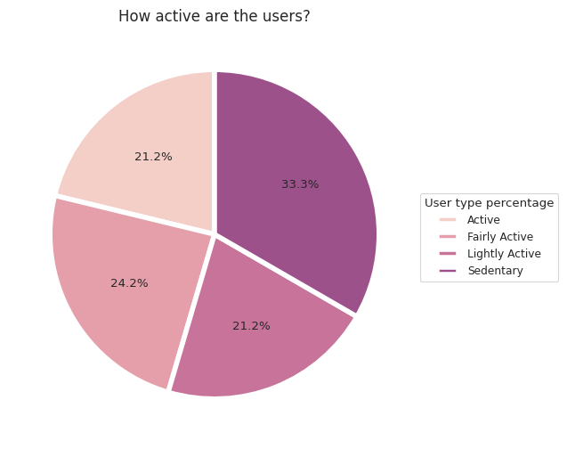
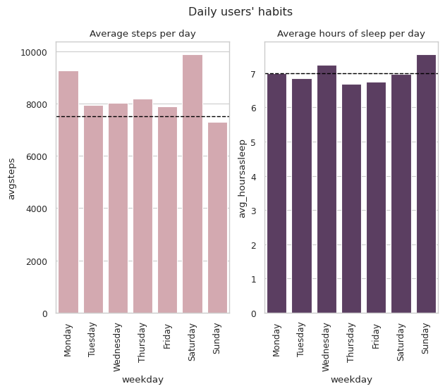
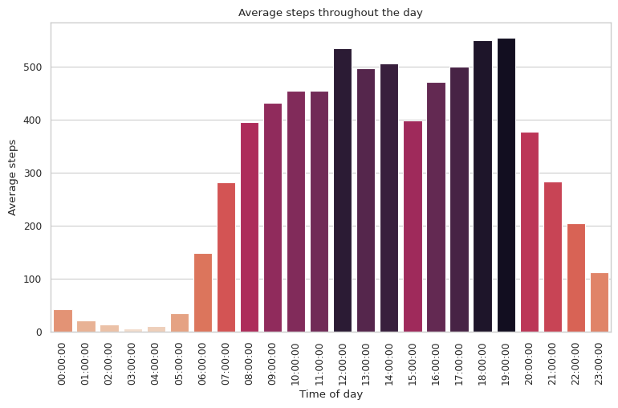
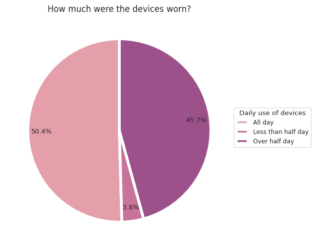

## Improving the Bellabeat devices functionalities and user engagement

[Click here](https://github.com/lugmenn/portfolio/blob/main/Fitbit_Analysis.ipynb) to read the full project report (available in Spanish).

In this project, the main goal was to study the way some users use smart devices intended for health improvement, similar to some of the Bellabeat products.

Data from 33 FitBit users collected in a two month period was analyzed in order to make some recommendations regarding the functionalities of the wearable devices and the way these devices were used in a daily manner.
These records included time spent in activity or at rest, the intensity levels of that activity, recorded total daily number of steps and steps per hour during the day, total time in bed and hours asleep.

In order to determine the usage of the devices, cleaned and transformed data from the different available tables was merged into dataframes, where data was grouped, categorized and aggregated with summary statistics.

### Who are the users?

Defining different types of users based on the average daily activity recorded.


```
# Data cleansing and the rest of the ETL process is not shown here

# function definition to categorize data in the dataframe


def user_type(steps):
  if steps < 5000:
    return "Sedentary"
  elif (steps>=5000) & (steps<7499):
    return "Lightly Active"
  elif (steps>=7500) & (steps<9999):
    return "Fairly Active"
  else:
    return "Active"


# applying the function based on a field from the dataframe

avgact['activity_level'] = avgact['avgsteps'].apply(lambda x: user_type(x))


# calculating quantity and percentages for each category of user based on activity levels

types_ofuser = (avgact.groupby('activity_level')['avgsteps']
                .count()
                .to_frame('no. of users'))
totalusers = types_ofuser['no. of users'].sum()
types_ofuser['user percentage'] = types_ofuser['no. of users']/totalusers

# plotting the percentages into a pie chart

colors = sns.cubehelix_palette(hue=1)
sns.set_style('whitegrid')
plt.figure(figsize=(6,6))
plt.pie(types_ofuser['user percentage'],
        colors=colors,
        autopct='%1.1f%%',
        startangle=90,
        wedgeprops = {'linewidth': 4},
        center = (0.1,0.1))
plt.legend(title='User type percentage',
           bbox_to_anchor=(1.0, 0.6),
           loc='upper left', borderaxespad=0,
           labels = types_ofuser.index)
plt.title('How active are the users?', size=12)
plt.show()
```


### Users' habits

How do the users' activity and sleep vary across the week?


```
# extracting the names of the days of the week from each record's date

act_sleep['weekday'] = act_sleep['activitydate'].dt.day_name()


# summarizing average steps and hours spent asleep by day 

days = ['Monday','Tuesday','Wednesday','Thursday','Friday','Saturday', 'Sunday']
daily_sleep = (act_sleep.groupby('weekday')
               .agg({'totalsteps': np.nanmean, 'hoursasleep' : np.nanmean})
               .reindex(days))
daily_sleep.rename(columns={'totalsteps':'avgsteps', 'hoursasleep': 'avg_hoursasleep'},inplace=True)
```


```
# finding how the physical activity changes throughout the day. Registered steps per hour.

stepsperhour = hourlysteps.groupby('activitytime')['steptotal'].mean().to_frame().

# plotting the data into a bar chart

plt.figure(figsize=(9,5))
pal = sns.color_palette("rocket", 24)
rank = stepsperhour['avg steps'].argsort().argsort()
ax=sns.barplot(x = stepsperhour.index, y = stepsperhour['avg steps'], palette=np.array(pal[::-1])[rank])
plt.xticks(rotation=90)
ax.set(xlabel='Time of day', ylabel='Average steps')
plt.title('Average steps throughout the day')
plt.show()
```


### How much are the devices used each day?

Finding out the percetage of users that used their devices all day, more than half a day o less than half a day.


```
# calculating the device's time of use each day and the percentage of that day (total used time/time in a day)

dailyact_clean['minutes used'] = (dailyact_clean['veryactiveminutes'] + dailyact_clean['fairlyactiveminutes'] + 
                                  dailyact_clean['lightlyactiveminutes'] + dailyact_clean['sedentaryminutes'])
dailyact_clean['daily usage ratio'] = dailyact_clean['minutes used']/1440


# assigning a category based on the usage ratio
def daily_usage(ratio):
  if ratio == 1:
    return "All day"
  elif (ratio >= 0.5) & (ratio < 1):
    return "Over half day"
  else:
    return "Less than half day"

dailyact_clean['worn']= dailyact_clean['daily usage ratio'].apply(lambda x: daily_usage(x))

# grouping the data by each usage category

usagerate = dailyact_clean.groupby('worn')['id'].count().to_frame()
usagerate.rename(columns={'id':'total days'},inplace=True)
usagerate['total percentage'] = usagerate['total days']/usagerate['total days'].sum()
```


### Sharing Insights

The analysis on the records obtained from FitBit devices had the main purpose of discovering the way some users use these kind of health-focused devices in order to extrapolate the results and identify possible growth opportunities for the continous development and improvement in Bellabeat's products while increasing its user engagement. These are some of the findings and the proposed actions to be analyzed by the company's leaders.

1. **Development of a notification and pop-up messages system for physical activity**: Due to the findings most users don't complete the number of daily steps recommended by health authorities, we propose a **notification system so the user can remember to get active throughout the day or at the hours recorded to have an increase in their activity as well as its intensity**. Also, a series of **pop-up messages on the smart watches and on the app interface might result useful as a way to give tips and let them know the benefits of mantaining or adquiring an active lifestyle**.

2. **Notification and messages system based on sleep goals**: The analysis also showed most users don't get their minimum of 7 hours of sleep per day (as recommended by health authorities). Because of this we consider appropiate another **notification system based on a selected hour by the user in order for them to start preparing to go to bed and get enough hours of sleep. It would also be useful to give the users different tips in order for them to start changing their habits to get a better sleep quality**.

3. **Creation of a reward system**: To increase the daily records on each device, a reward system implementation could be helpful in order to increase the user engagement. This system could be based on **reaching levels and gaining points for the number of hours registered each day**. Then, these points or levels could be used to access discounts for some of the available products or getting access to some benefits on Bellabeat's services.


```

```
