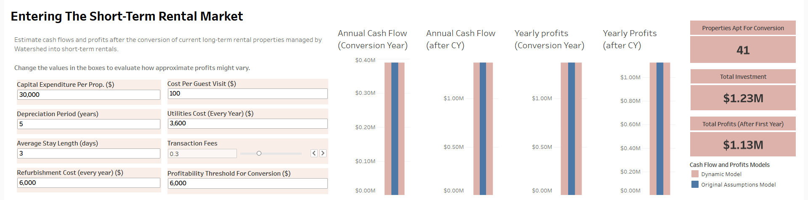
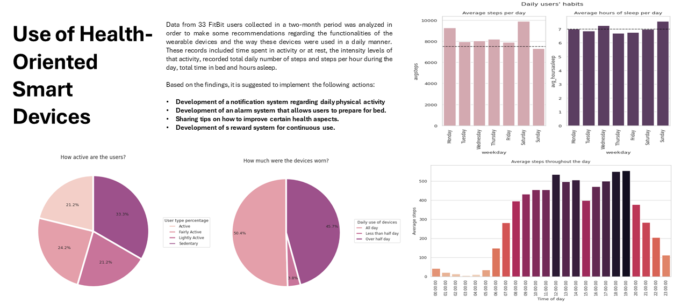
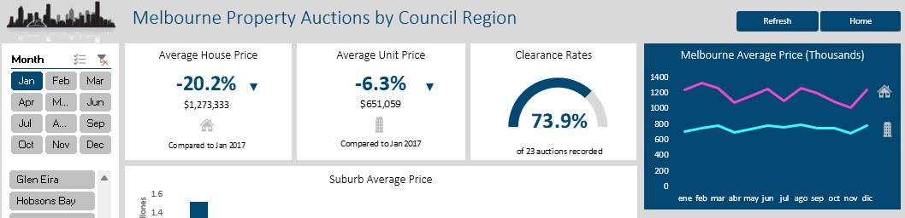

# Data Analysis

Hello there!

Technical Skills: **Excel**, **SQL**, **Tableau**, **PowerBI**, **Python**, **R**, **Google Cloud Platform**

## Projects

### 1. Change in profits in the real estate industry

[Data extraction using **SQL** queries](2024_03_watershed_database) 

[**Tableau** dashboard showcasing profits with adjustable parameters](https://public.tableau.com/views/WatershedProject_17105411802030/Dashboard1?:language=es-ES&:sid=&:display_count=n&:origin=viz_share_link)

Rough estimate in the changes of profits after converting certain long-term rental properties into the short-term rental market. The approximate change in profit analysis took into account the properties' location and their expected occupancy rates throughout the year.

### 2. Improvement of Bellabeat devices and their user engagement

[Data transformation with **Python** report]

[Analysis completed with **Python**](2024_06_bellabeat_analysis.md)

Shared insights and recommended business actions based on the analysis of activity data recorded by 33 users of FitBit devices during two months as a way of finding growth opportunities in Bellabeat's products for health improvement and some possible roads to increase user engamement.

### 3. Finding the correlation between different North-American metropolitan areas' population and their Big Four teams' Win/Lose ratio

[NFL teams Win/Lose ratio correlation analysis using **Python/Pandas**]()

This analysis consisted of finding through the Pearson correlation how closely related are the Metropolitan Area population size and the Win/Lose ratio of the teams from each league. Is it reasonable to expect a team to be more likely to win if the city it is based on is big, is the opposite to be expected or is there no relationship at all?

The Big Four refers to the major professional sports leagues across North America (USA and Canada). These leagues include NFL, NBA, MBL and NHL, which contain 30 to 32 teams each, and are mostly based on the top populated metropolitan areas in both countries. 

### 4. Quick insights for the Dognition development team

### 5. Global sales report for a cycling business

Global sales report from cycling specialized business on Power Bi, including revenue from 2018-2021 period and sales by items category, location and month-to-month changes by fiscal year. 

### 6. Trends in the Melbourne Property Market

[Property Market Report in **Excel**](2024_01_propertymarket_trends.md)

The main objective was to deliver a report to showcase the trends and key metrics in the property market during 2017 and 2018 in some suburbs in the Melbourne Metropolitan Area, Australia. Overall, findings suggest there was an increase in the average house and apartment prices in most of the suburbs.

### 7. Transforming raw sales data

[Data cleansing and transformation process in **Excel**](2024_01_excel_cleaningdata.md)

The original spreadsheet file included records of monthly sales , but in an unusable format for processing. Here, I discuss data transformation step by step with some Microsoft Excel functions to generate useful data, ready to be used for a future analysis.

## Education

 B.S. Biology | Universidad Nacional Autónoma de México (_July 2021_)

## Courses and Certificates

* [Introduction to Data Science in Python](https://coursera.org/share/d8f3565476016680b49061be0075ad8e) | University of Michigan (_June 2024_)

* [Excel Skills for Data Analytics and Visualization](https://coursera.org/share/17f45e990b48d0b0a348ee784ee9415b) | Macquaire University (_January 2024_)

* [Google Data Analytics Certificate](https://coursera.org/share/e65da5f6042aa495d7ab29db87ade125) | Google (December 2023)

More coming soon.
Thank you for browsing.

See you later, alligator.
